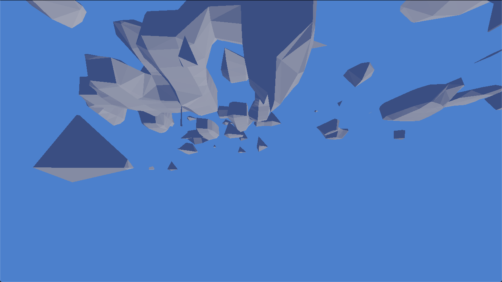

# skunkwork

A lightweight framework for fooling around with GLSL-shaders, mainly designed for demos. Current features:

- Includes in glsl
  - nesting supported
  - error lines parsed into vscode links per file on some drivers
    - filepath and raw error line otherwise
- Dynamic uniform edit UI
  - `d*` Hungarian notation uniforms are picked up
  - `bool`, `float`, `int`, `uint`, `(u/i)vec2`, `(u/i)vec3` and `(u/i)vec4` supported
- Auto-reloading shaders when sources change
- Gpu-"profiler"
  - Timing instances can't be interleaved because GL_TIMESTAMP doesn't work on OSX
- Music playback and sync using SDL_mixer
- Rocket-interface
  - `float` uniforms using `r*` Hungarian notation are picked up
- Mercury's [hg_sdf](http://mercury.sexy/hg_sdf) included for CSG
- Basic built-in shaders
  - noise, prng
  - physically based BRDF for shading
  - SDF font rendering

I have used [emoon's](https://github.com/emoon/rocket) as my Rocket-server.

## Releases

- [Vapor](https://www.youtube.com/watch?v=4k-BJig1lK8) - sndels
- [Veipör](https://www.youtube.com/watch?v=8B8k2klhGAo) - fugtional
- [Cubnature](https://www.youtube.com/watch?v=jPcddtRBYu8) - as graffa bois
- [Rekursiivinen Templete](https://www.youtube.com/watch?v=NA99MrZvlBM) - as graffa bois
- [Twos Complement](https://www.youtube.com/watch?v=mN_lOFTe_ro) - as graffa bois

## Build targets

There are two builds: `skunkwork` holds all the bells and whistles while `skunktoy` drops Rocket and audio integration for more minimalist shader tinkering.

## Dependencies

Building requires SDL dependencies and on linux `libasound2-dev`. [SDL](https://github.com/libsdl-org/SDL.git), [SDL_mixer](https://github.com/libsdl-org/SDL_mixer), [dear imgui](https://github.com/ocornut/imgui), [Rocket](https://github.com/rocket/rocket) and [gl3w](https://github.com/sndels/libgl3w) are submodules with their respective licenses.

## Building

The CMake-build should work™ on Linux (Ninja) and Windows 10 (Visual Studio 2022).
